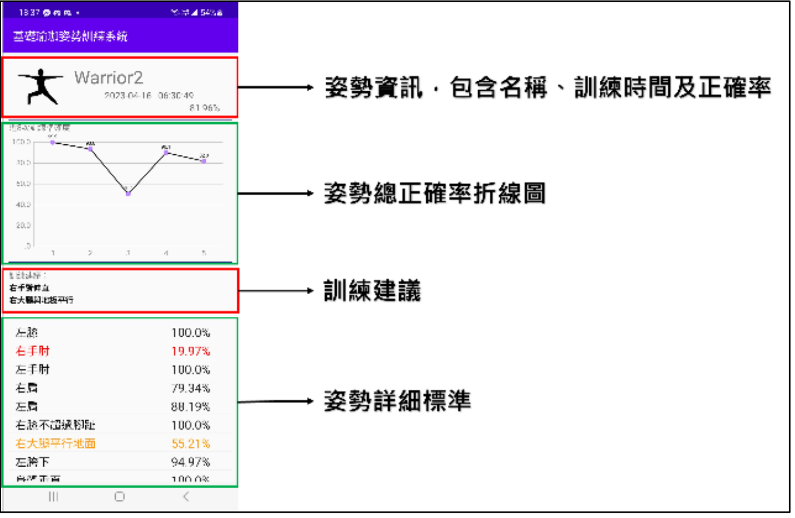
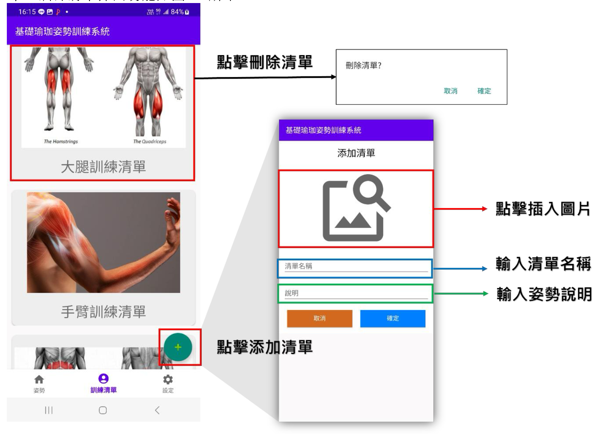
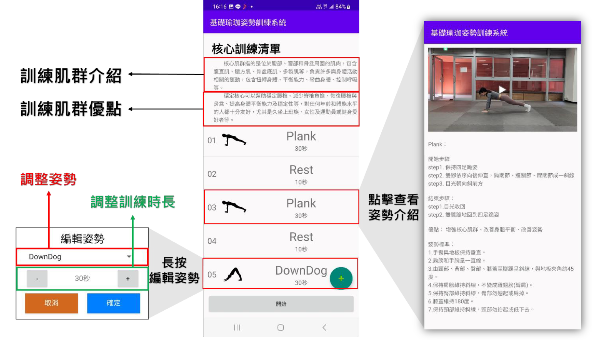
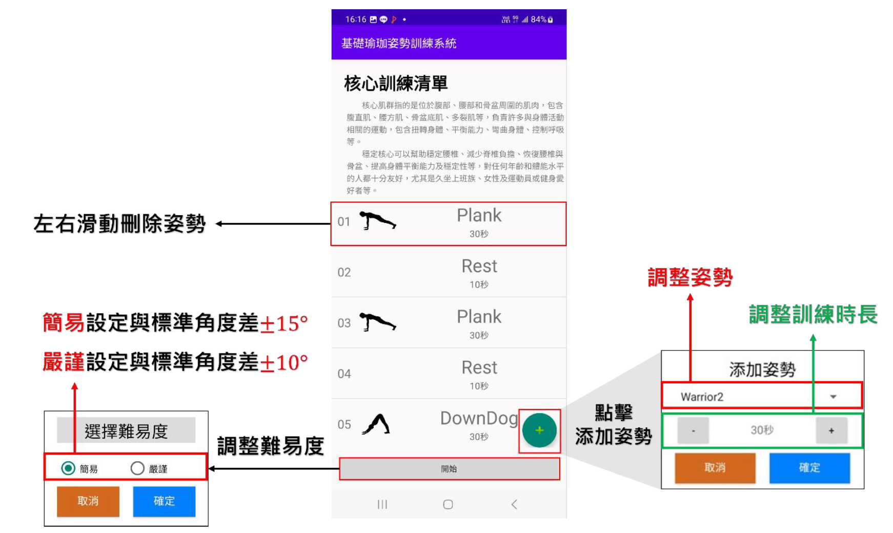
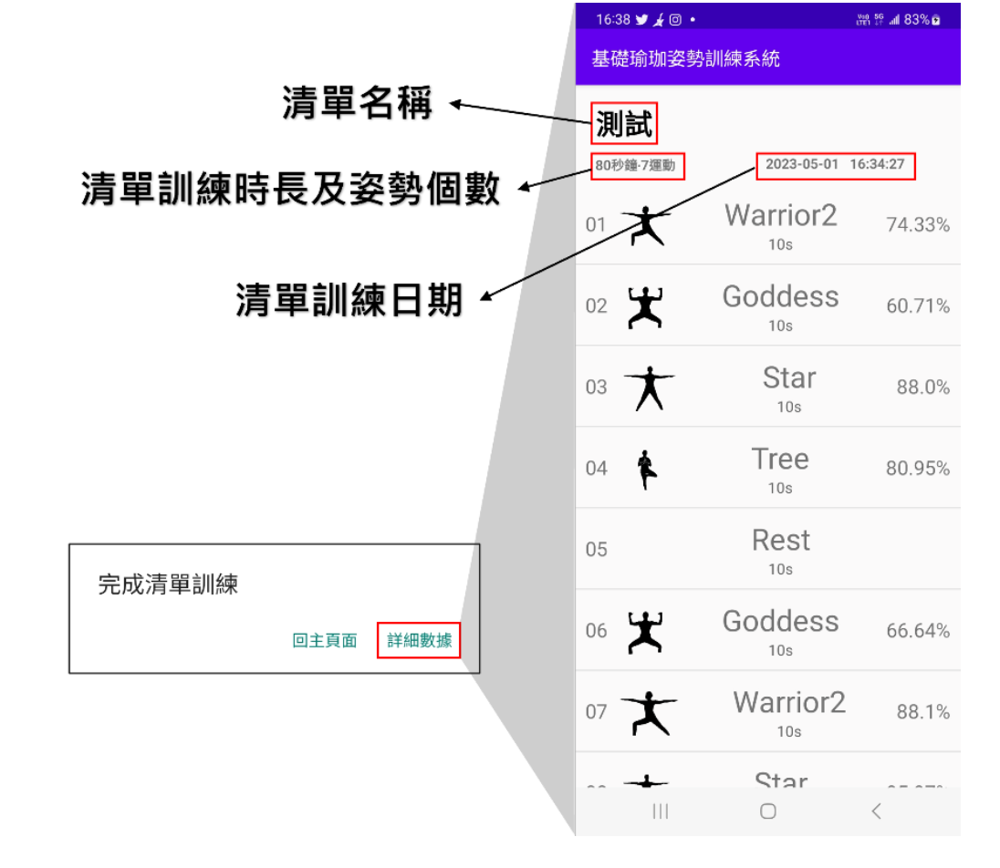

# An Android-Based Fundamental Yoga Pose Training and Evaluation System Using MediaPipe Pose Estimation
This project aims to develop an Android-based system that assists users in practicing yoga poses correctly and conveniently. By leveraging **MediaPipe’s pose estimation framework**, the system detects human skeletal keypoints in real time and calculates **joint angles** to evaluate posture accuracy.
It provides **customizable training lists**, allowing users to practice multiple yoga poses in a single session. The integrated **voice feedback system** delivers real-time verbal instructions and corrections whenever an incorrect posture is detected, helping users adjust immediately.
After each training session, users can review detailed evaluation data through the app, including joint angle analysis, accuracy scores, and improvement suggestions. This enables users to effectively enhance their posture performance even without direct guidance from a yoga instructor.

The system consists of three main functional modules:  
  &bull; **Pose List:** Displays 10 fundamental yoga poses with descriptions, individual detection, and analysis features.  
  &bull; **Training List:** Provides preset or user-defined training routines, supporting batch pose training and detailed performance feedback.  
  &bull; **Settings:** Includes history record management, camera switching, user guide, and feedback submission functions.  

Developed with **Android Studio** and implemented with **multithreading and voice integration**, this system delivers an intelligent and interactive yoga training experience — combining real-time analysis, instant feedback, and comprehensive performance tracking.

## 🛠️ Tech Stack  
&bull; Android Studio  
&bull; Mediapipe  
&bull; SQLite  
&bull; MPAndroidChart  

## 🌟 Key Technical Contributions  
This project's contributions and technical challenges focused on:  
**1. AI and Angle Calculation Model Implementation:** Responsible for integrating the MediaPipe framework and designing the joint angle calculation formulas used to quantify posture deviation for assessment accuracy.

**2. High-Efficiency Mobile Deployment:** Used Android Studio to develop a user-friendly interface and optimized multithreading mechanisms to ensure real-time performance and responsiveness of AI computation and voice feedback on the mobile device.

**3. System Integration and Feature Buildout:** Led the development of key system features including the customized training list, historical records, detailed assessment reports (as shown in Figure 1.2), and real-time voice notification.

**4. Academic Validation:** Project outcomes were compiled and successfully submitted to the CVGIP Conference, validating the research's academic merit.

## 🎥 Demonstration  

  
<i>Figure 1. This interface provides detailed explanations of each yoga pose, offers adjustment suggestions, and allows users to select difficulty levels.</i>
  
 
<i>Figure 2. This figure displays detailed pose evaluation data after completing a training session, including:  </i>
  
<i>- Pose information and standard reference</i>  
<i>- Overall pose accuracy line chart</i>  
<i>- Performance summary and improvement recommendations</i>  
  
  
  
<i>Figure 3. This interface allows users to create and manage personalized yoga training routines by selecting multiple poses based on their goals.</i>  
  
   
   
<i>Figure 4.1, 4.2 These figures show that users can:  </i>
  
<i>- Add or remove yoga poses freely</i>  
<i>- Adjust training duration and difficulty for each pose</i>  
<i>- Use system-provided preset training routines based on targeted muscle groups</i>  
  
  
<i>Figure 5. This screen displays the overall performance summary of a completed training list, including:</i>  
  
<i>- Training list name</i>  
<i>- Total training duration and number of poses</i>  
<i>- Training date</i>  
<i>- Individual pose performance, which can be viewed in detail</i>  
